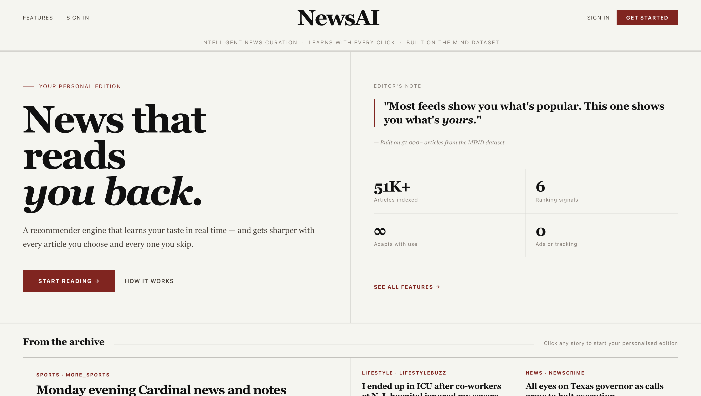
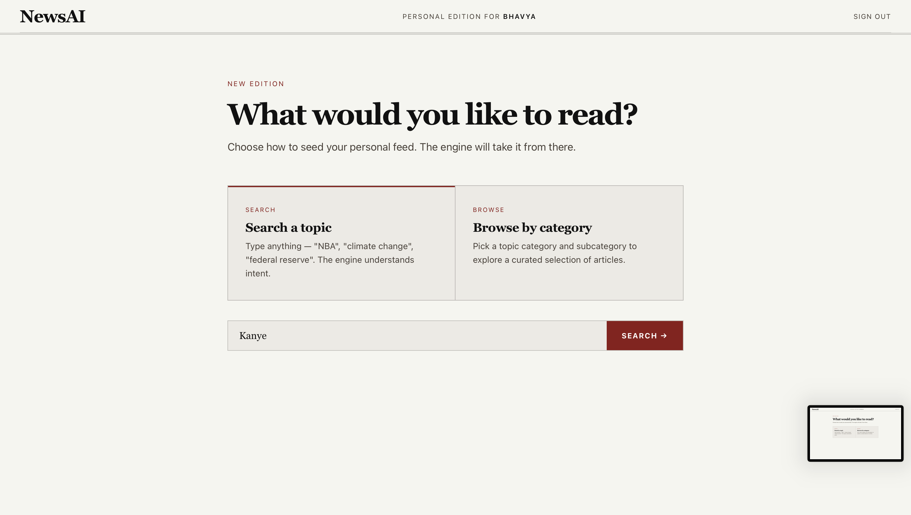
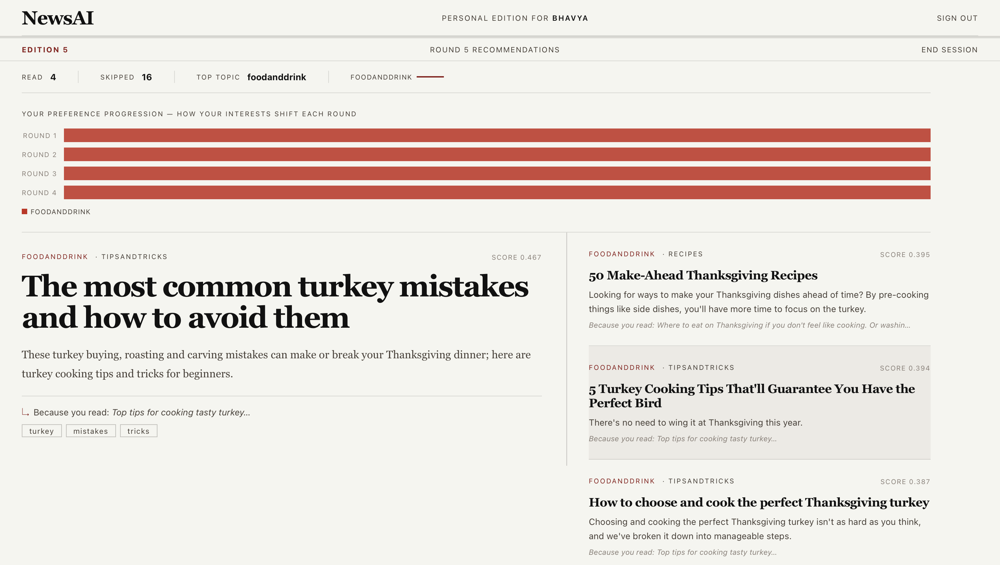

<div align="center">

# NewsAI

### A personalized news recommender with a newspaper-style interface

<p>
  
  
  
  
</p>

<p>
  NewsAI learns from what a user reads, what they skip, and how their interests shift in real time.
</p>

</div>

## Why It Stands Out

- Personalizes recommendations live within the same session
- Uses both positive feedback and skipped-article penalties
- Blends similarity, popularity, and recency in one ranking score
- Adds explainability with “Because you read...” reasoning and keywords
- Presents results in a polished editorial-style UI instead of a generic dashboard

## Visual Tour

### Landing Page


### Cold Start Flow


### Adaptive Recommendation Rounds


## How It Works

NewsAI is built on the Microsoft MIND Small dataset and uses TF-IDF + cosine similarity to build a dynamic user interest profile.

The recommendation loop is simple and effective:

1. A user starts with topic search or category browsing.
2. Seed articles create an initial profile vector.
3. Every clicked article strengthens the profile.
4. Every skipped article lightly pushes the profile away from unwanted content.
5. New articles are ranked using:

`score = 0.8 × similarity + 0.1 × recency + 0.1 × popularity`

To avoid repetitive feeds, one slot is intentionally reserved for a different subcategory.

## Core Features

- Search-based and category-based cold start
- Real-time adaptive recommendations
- Negative feedback from skipped stories
- Diversity injection for broader discovery
- Recommendation explanations and keyword cues
- Session summary with reading history and topic progression

## Tech Stack

- Python
- Flask
- Pandas
- NumPy
- scikit-learn
- SciPy
- Jinja2
- HTML, CSS, JavaScript

## Run Locally

```bash
git clone <your-repo-url>
cd <your-repo-folder>
python -m venv venv
source venv/bin/activate
pip install -r requirements.txt
python app.py
```

Open `http://localhost:5000`

Dataset files expected in `MINDsmall_train/`:

- `news.tsv`
- `behaviors.tsv`

## Quick Take

NewsAI is a compact full-stack ML product: a recommender system, an interaction loop, and a strong interface working together in one polished project.
